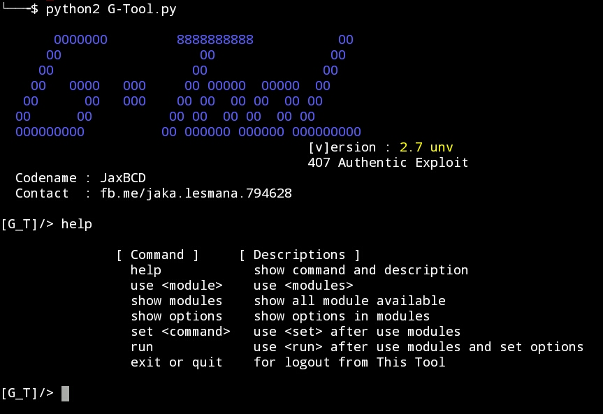

#### Instalation
```
apt-get install python2 git
git clone https://github.com/jaxBCD/G-Tools.git
python2 -m pip install  -r requirements.txt
cd G-Tools
python2 G-Tool.py
```

#### Usage
```
type Command "help" for show usage and all command
```


